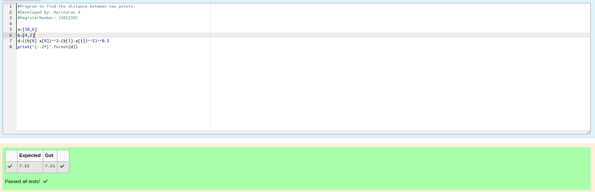

# DISTANCE-BETWEEN-TWO-POINTS

## AIM:
To write a python program to find the distance two 2 points
## ALGORITHM:
### Step 1: 
Start the program
### Step 2: 
ASsign values for the variables x1,x2,y1,y2
### Step 3: 
Substitute the values in the distance formula  
### Step 4: 
Print distance using format to display the answer with two decimal points 
### Step 5: 
End the program
### PROGRAM:
```
#Program to find the distance between two points.
#Developed by: Hariharan A
#RegisterNumber: 23012392

a=[10,6]
b=[4,2]
d=((b[0]-a[0])**2+(b[1]-a[1])**2)**0.5
print("{:.2f}".format(d))
```

### OUTPUT :



### RESULT:
Thus the two points is successfully executed
